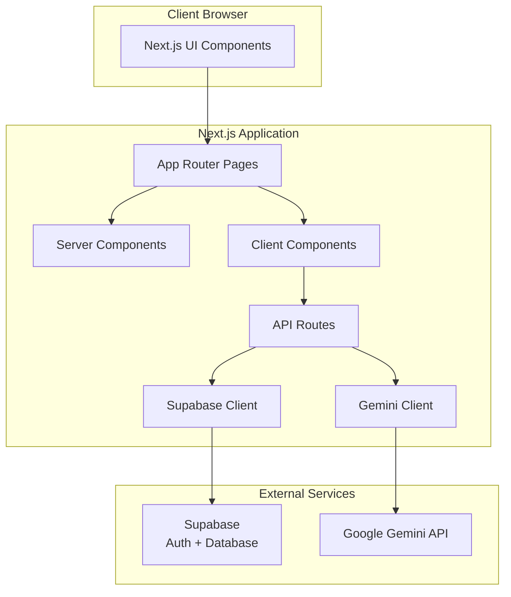

# Design Document

## Overview

FinBuddy is a Next.js web application built with TypeScript and Tailwind CSS, utilizing Supabase for backend services and Google Gemini for AI-powered insights. The application follows a modern React architecture with the Next.js App Router, server components, and client components where interactivity is required. The design emphasizes separation of concerns with dedicated layers for UI components, business logic, data access, and external service integration.

## Architecture

### High-Level Architecture



### Technology Stack

- **Frontend Framework**: Next.js 14+ with App Router
- **Language**: TypeScript
- **Styling**: Tailwind CSS
- **Authentication & Database**: Supabase
- **AI Service**: Google Gemini API (gemini-1.5-pro model)
- **Charts**: Recharts library
- **Deployment**: Vercel

### Application Structure

```
/app
  /dashboard
    page.tsx                    # Main dashboard page (server component)
    /components
      ExpenseList.tsx           # Client component for expense list
      ExpenseForm.tsx           # Client component for add/edit form
      ExpenseChart.tsx          # Client component for pie chart
      SpendingTrend.tsx         # Client component for line chart
      AIInsights.tsx            # Client component for AI insights
      MonthlySummary.tsx        # Server component for summary
  /login
    page.tsx                    # Login page
  /signup
    page.tsx                    # Signup page
  /profile
    page.tsx                    # User profile page
  /api
    /expenses
      route.ts                  # CRUD operations for expenses
    /insights
      route.ts                  # AI insights generation
    /profile
      route.ts                  # Profile operations
  layout.tsx                    # Root layout with auth check
  page.tsx                      # Landing/home page

/lib
  supabaseClient.ts             # Supabase client initialization
  supabaseServer.ts             # Server-side Supabase client
  gemini.ts                     # Gemini API integration
  types.ts                      # TypeScript type definitions

/components
  AuthProvider.tsx              # Authentication context provider
  Navigation.tsx                # App navigation component

/hooks
  useExpenses.ts                # Custom hook for expense operations
  useAuth.ts                    # Custom hook for auth state
```

## Components and Interfaces

### Authentication Layer

**AuthProvider Component**
- Manages authentication state using Supabase Auth
- Provides user context to child components
- Handles session persistence and refresh

**Login/Signup Pages**
- Form components with email/password inputs
- Client-side validation
- Error handling for auth failures
- Redirect to dashboard on success

### Dashboard Components

**Dashboard Page (Server Component)**
- Fetches initial expense data server-side
- Renders MonthlySummary, ExpenseChart, SpendingTrend, AIInsights
- Passes data to client components as props

**MonthlySummary Component**
- Displays total spending for current month
- Calculates sum of expenses filtered by current month
- Renders formatted currency value

**ExpenseList Component (Client)**
- Displays paginated list of expenses
- Provides edit and delete actions per expense
- Handles optimistic UI updates
- Sorts expenses by date descending

**ExpenseForm Component (Client)**
- Modal or inline form for add/edit operations
- Fields: amount (number), category (select), date (date picker), note (textarea)
- Client-side validation
- Submits to API route

**ExpenseChart Component (Client)**
- Pie chart using Recharts
- Aggregates expenses by category for current month
- Color-coded segments
- Shows percentage and amount per category
- Empty state when no data

**SpendingTrend Component (Client)**
- Line chart using Recharts
- X-axis: dates (last 30 days)
- Y-axis: daily spending totals
- Tooltip showing date and amount
- Empty state when no data

**AIInsights Component (Client)**
- Button to trigger insights generation
- Loading state during API call
- Displays formatted AI response
- Error handling with retry option

### API Routes

**POST /api/expenses**
- Creates new expense record
- Validates required fields
- Associates with authenticated user
- Returns created expense

**GET /api/expenses**
- Retrieves all expenses for authenticated user
- Optional query params for date range filtering
- Returns array of expense objects

**PUT /api/expenses/[id]**
- Updates existing expense
- Validates ownership
- Returns updated expense

**DELETE /api/expenses/[id]**
- Deletes expense by ID
- Validates ownership
- Returns success status

**POST /api/insights**
- Accepts expense data in request body
- Calls Gemini API with formatted prompt
- Returns AI-generated insights text
- Handles API errors gracefully

**GET /api/profile**
- Retrieves user profile data
- Returns name and preferred currency

**PUT /api/profile**
- Updates user profile
- Validates input
- Returns updated profile

**DELETE /api/profile**
- Deletes all user expenses
- Deletes user account from Supabase Auth
- Returns success status

## Data Models

### Database Schema

**expenses table**
```sql
create table expenses (
  id uuid primary key default uuid_generate_v4(),
  user_id uuid references auth.users(id) on delete cascade,
  amount numeric not null check (amount > 0),
  category text not null,
  note text,
  date date not null default current_date,
  created_at timestamp with time zone default now(),
  updated_at timestamp with time zone default now()
);

-- Index for efficient user queries
create index idx_expenses_user_id on expenses(user_id);
create index idx_expenses_date on expenses(date desc);

-- Row Level Security policies
alter table expenses enable row level security;

create policy "Users can view own expenses"
  on expenses for select
  using (auth.uid() = user_id);

create policy "Users can insert own expenses"
  on expenses for insert
  with check (auth.uid() = user_id);

create policy "Users can update own expenses"
  on expenses for update
  using (auth.uid() = user_id);

create policy "Users can delete own expenses"
  on expenses for delete
  using (auth.uid() = user_id);
```

**profiles table** (extends Supabase auth.users)
```sql
create table profiles (
  id uuid primary key references auth.users(id) on delete cascade,
  name text,
  preferred_currency text default 'USD',
  created_at timestamp with time zone default now(),
  updated_at timestamp with time zone default now()
);

-- Row Level Security
alter table profiles enable row level security;

create policy "Users can view own profile"
  on profiles for select
  using (auth.uid() = id);

create policy "Users can update own profile"
  on profiles for update
  using (auth.uid() = id);
```

### TypeScript Types

```typescript
// lib/types.ts

export interface Expense {
  id: string;
  user_id: string;
  amount: number;
  category: string;
  note?: string;
  date: string; // ISO date string
  created_at: string;
  updated_at: string;
}

export interface ExpenseInput {
  amount: number;
  category: string;
  note?: string;
  date: string;
}

export interface Profile {
  id: string;
  name?: string;
  preferred_currency: string;
  created_at: string;
  updated_at: string;
}

export interface MonthlySummary {
  total: number;
  month: string;
  year: number;
}

export interface CategoryAggregate {
  category: string;
  total: number;
  percentage: number;
}

export interface DailySpending {
  date: string;
  total: number;
}

export interface AIInsightsResponse {
  insights: string;
  generated_at: string;
}
```

### Predefined Categories

```typescript
export const EXPENSE_CATEGORIES = [
  'Food & Dining',
  'Transportation',
  'Shopping',
  'Entertainment',
  'Bills & Utilities',
  'Healthcare',
  'Education',
  'Travel',
  'Personal Care',
  'Other'
] as const;

export type ExpenseCategory = typeof EXPENSE_CATEGORIES[number];
```

## Error Handling

### Client-Side Error Handling

- Form validation errors displayed inline
- Network errors shown via toast notifications
- Retry mechanisms for failed API calls
- Graceful degradation when charts have no data

### Server-Side Error Handling

- API routes return standardized error responses
```typescript
interface ErrorResponse {
  error: string;
  message: string;
  statusCode: number;
}
```

- Authentication errors return 401
- Authorization errors return 403
- Validation errors return 400
- Server errors return 500
- All errors logged for debugging

### Supabase Error Handling

- Connection failures handled with retry logic
- Auth session expiry triggers re-authentication
- Database constraint violations return user-friendly messages

### Gemini API Error Handling

- Rate limit errors trigger exponential backoff
- API failures show fallback message
- Timeout after 30 seconds
- Malformed responses handled gracefully

## Testing Strategy

### Unit Tests

- Utility functions for data aggregation
- Date formatting and calculation functions
- Currency formatting functions
- Validation logic

### Integration Tests

- API route handlers with mocked Supabase client
- Gemini API integration with mocked responses
- Authentication flows

### Component Tests

- Form submission and validation
- Chart rendering with various data scenarios
- Empty states
- Loading states
- Error states

### End-to-End Tests

- Complete user flows: signup → add expense → view dashboard → get insights
- Authentication flows
- CRUD operations on expenses
- Profile management

## Security Considerations

### Authentication & Authorization

- All API routes verify authenticated session
- Row Level Security (RLS) enforces data isolation in Supabase
- User ID from auth token used for all database queries
- No client-side user ID manipulation possible

### Data Validation

- Server-side validation for all inputs
- SQL injection prevented by Supabase parameterized queries
- XSS prevention via React's built-in escaping
- Amount validation ensures positive numbers

### API Security

- Environment variables for sensitive keys (Supabase URL/Key, Gemini API Key)
- CORS configured for production domain only
- Rate limiting on AI insights endpoint
- No sensitive data in client-side code

### Privacy

- User data isolated per account
- No data sharing between users
- Account deletion removes all associated data
- Gemini API calls do not store user data (per Google's policy)

## Performance Considerations

### Data Fetching

- Server components fetch initial data
- Client components use SWR or React Query for caching
- Pagination for expense lists (50 items per page)
- Date range filtering to limit data transfer

### Chart Rendering

- Recharts renders efficiently with memoization
- Data aggregation performed server-side when possible
- Limit trend chart to 30 days of data

### Caching Strategy

- Static pages cached at CDN (landing page)
- Dashboard data revalidated on mutation
- Profile data cached with 5-minute stale time
- AI insights cached per request to avoid duplicate calls

### Bundle Optimization

- Code splitting via Next.js dynamic imports
- Recharts loaded only on dashboard
- Tailwind CSS purged of unused styles
- Image optimization via Next.js Image component

## Deployment Configuration

### Environment Variables

```
# Supabase
NEXT_PUBLIC_SUPABASE_URL=
NEXT_PUBLIC_SUPABASE_ANON_KEY=
SUPABASE_SERVICE_ROLE_KEY=

# Google Gemini
GEMINI_API_KEY=

# App
NEXT_PUBLIC_APP_URL=
```

### Vercel Configuration

- Automatic deployments from main branch
- Preview deployments for pull requests
- Environment variables configured in Vercel dashboard
- Edge functions for API routes (optional)

### Supabase Configuration

- Database hosted on Supabase cloud
- Connection pooling enabled
- Automatic backups configured
- SSL enforced for all connections

## Future Extensibility

The design supports future enhancements:

- **CSV Upload**: Add file upload API route and parsing logic
- **Budget Limits**: Add budget table and notification system
- **Multi-currency**: Extend profile model and add conversion API
- **AI Chat**: Add conversation history table and streaming responses
- **Recurring Expenses**: Add recurrence pattern to expense model
- **Shared Budgets**: Add household/group tables with permissions
